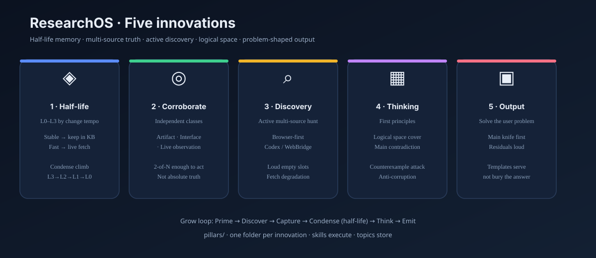

# ResearchOS

> **A research capability for coding agents.**  
> Five innovations: half-life knowledge · corroboration · active discovery · logical-space thinking · structured output.  
> Browser-first evidence. Markdown topics. Git as audit log.

[](./LICENSE)
[](./CHANGELOG.md)

---

## Five innovations

<!-- Hero: accurate labels (SVG). Generated raster alternative: docs/assets/pillars-hero.jpg (pending visual review). -->
<p align="center">
  
</p>

| # | Innovation | What it changes | Owner folder |
|---|---|---|---|
| **1** | **Half-life knowledge (L0–L3)** | Split memory by *how fast facts change* — not by “importance” | [`pillars/half-life/`](./pillars/half-life/) |
| **2** | **Multi-source corroboration** | Independent evidence *classes*; **2-of-N** is enough to *act* | [`pillars/corroboration/`](./pillars/corroboration/) |
| **3** | **Active discovery** | Agent must hunt live pages; empty slots are loud; browser-first | [`pillars/discovery/`](./pillars/discovery/) |
| **4** | **Logical space + first principles** | Cover the problem axes; name the main contradiction | [`pillars/thinking/`](./pillars/thinking/) |
| **5** | **Structured output** | Solve the user problem; main knife first, not an encyclopedia | [`pillars/output/`](./pillars/output/) |

Full index: [`pillars/README.md`](./pillars/README.md).

### Half-life in one table

| | **L0 · L1 (stable)** | **L2 · L3 (fast)** |
|---|---|---|
| Tempo | Years / structure | Weeks–months or faster |
| Practice | **Maintain in** topic KB | **Live fetch**; cache *outside* durable KB |
| Example | Long-run regional structure | Visa-free *this quarter*; **today’s** weather |

**Condense** = climb L3→L2→L1→L0 only when half-life allows (promotion guilty by default).

---

## Why not “more search”?

Search volume is commoditized.  
ResearchOS packages **how an agent should remember, verify, think, and deliver** — the transferrable research skill.

Intellectual cousins: **ReAct** (reason↔act) + logical-space planning + **half-life memory design**.  
**Not** a social-media scrape toolkit.

---

## 60-second start

```bash
git clone https://github.com/lxinfei5/research-os.git
cd research-os
```

1. Point your agent at **`AGENTS.md`** + `.agents/skills/`.  
2. `cp -R topics/_templates/topic topics/my_question`  
3. *“Run researchos-grow — browser-first; condense by half-life.”*  
4. Browser: **Codex** native · else **kimi-webbridge** / optional [`webbridge-mcp`](./tools/social_mcp/)

Demo: `topics/demo_hello_research/`.

---

## Repository layout

```
pillars/                 # ★ one folder per innovation (canonical method)
  half-life/             # L0–L3 thesis + condense protocols + corpus
  corroboration/
  discovery/             # + fetch-matrix
  thinking/
  output/
  examples/travel.md
rules/                   # thin redirects + shared ops only
.agents/skills/          # grow · condense · search · travel · …
topics/                  # per-topic knowledge instances (L0–L3 headings)
tools/social_mcp/        # optional browser bridge for non-Codex agents
docs/assets/             # diagrams
AGENTS.md                # constitution
```

**Constraint:** new method text goes under the matching `pillars/<name>/` only — never a second copy in skills or a growing `rules/` pile.

---

## Grow loop

```
Prime (L0/L1) → Discover (browser) → Capture
  → Condense (half-life + corroboration) → Think → Emit
```

---

## Example domain: travel

Live multi-source planning; fast facts stay live; durable trip *logic* can sit in L1.  
→ [`pillars/examples/travel.md`](./pillars/examples/travel.md)

---

## License

MIT — see [LICENSE](./LICENSE).
